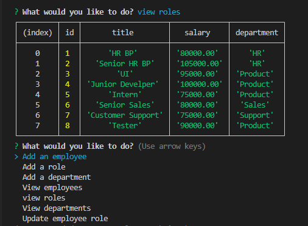
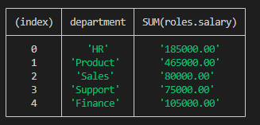

# Note Taker Express

* [GitHub repository](https://github.com/luizborges146/employee-departments) Link to the repository<br />
* [Video Link](https://drive.google.com/file/d/1oZsY8XVWa0WFYXKCUC9DEZ90gR9r0dep/view) This is the video showing the application<br />

 [](https://opensource.org/licenses/MIT)


    
## Table of Contents
    
1.  [Description](#description)
2.  [Instalation](#instalation)
3.  [Usage Infomration](#usage)
4.  [External support documentation](#externalDoc)
5.  [Tests](#tests)
6.  [Social](#social)
7.  [Plugins](#plugins)
8.  [License](#license)
    
## [Description](#description)
The idea of this application is to be able to create an employee track system, so the manager can see who they hire, what department they work, who they work for, the salary they are paying for each role, and not only that, add new employee, roles and departments. The application also allows the user to update the employee table, letting them to change the manger and role.



## [Instalation](#instalation)
N/A    
    
## [Usage](#usage)
Simple and visual access to the Notes.
 * Funcitonalities.
   * View all employees, roles and departments.
   * Add new employee, roles and departments.
   * Update employee role.
   * Application use CREATE, READ UPDATE in SQL.

##### Bonus
   * View total salary per department
   * Update employee manager




#### Function below is related to the addNewEmployee function, I need to do an extra research as the response from the system was giving name of the role and not the ID (getChoice), so the way to over come it was to create result[result.findIndex((role => role.Title = response.role))].id, that will basically get the index it and conver to the ID before INSERT it to the employee table.
```
            {
                name:"role",
                type:"list",
                choices: function() {
                    let getChoice = result.map((choice) => choice.title);
                    console.log(getChoice);
                    return getChoice;
                },
                message:"What is their role?",
            },
            {
                name:"manager",
                type:"input",
                message:"What is The Manager ID?",
            },
        ])
        .then((response) => {
            db.query(`INSERT INTO employee(f_name,l_name,role_id,manager_id)
            VALUES(?,?,?,?)`, [response.firstName, response.lastName, result[result.findIndex((role => role.Title = response.role))].id, response.manager]
            );
            menu();
```

  

## [External support documentation](#externalDoc)
    

- [W3School](https://www.w3schools.com/)<br />
- [Mozilla](https://developer.mozilla.org)<br />
- [READ.me](https://docs.readme.com/docs/linking-to-pages")<br />
- [GitHub](https://pages.github.com/)<br />
- [npm inquirer GitHub link](https://github.com/SBoudrias/Inquirer.js/blob/master/README.md#installation)<br />
- [npm mysql](https://www.npmjs.com/package/mysql2)<br />
- [npm](https://www.npmjs.com/)<br />
- [Template Literals](https://developer.mozilla.org/en-US/docs/Web/JavaScript/Reference/Template_literals)<br />
- [NodeJs - Path.join](https://nodejs.org/api/path.html#pathjoinpaths)<br />

    
## [Tests](#tests)
N/A
    
## [Social](#social)
if you need any further information or support, please, send an email to: luiz.borges.146@gmail.com
    
[](https://github.com/luizborges146) [](https://www.linkedin.com/in/luiz-borges-2377b7142/)
    
    
    
## [Plugins](#plugins)
N/A
    
## [License](#license)
License Information: [MIT](https://opensource.org/licenses/MIT);

Created by Luiz Borges
Please refer to the LICENSE in the repo.
